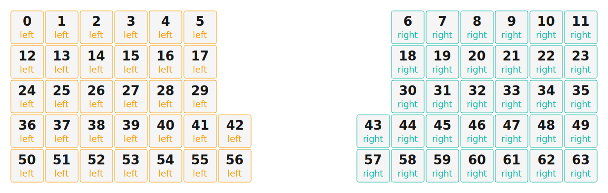

# ZMK Configuration for Stainless

*Generated by Shield Wizard for ZMK*



Download compiled firmware from the Actions tab. <https://zmk.dev/docs/user-setup#installing-the-firmware>

Edit your keymap <https://zmk.dev/docs/keymaps>.
User keymap is located at [`config/stainless.keymap`](config/stainless.keymap).

-----

<details>
<summary>
Shield Wizard Debug Information
</summary>

In case of broken configuration, here is the Shield Wizard internal data used to generate this configuration:

Commit: 5840d41ac0915092c8fe45da617ffb4bb91e1b97

```json
{"name":"Stainless","shield":"stainless","dongle":true,"modules":[],"layout":[{"id":"01KMHD7SJW9NSD5V8015Z4S6BS","part":0,"row":0,"col":0,"w":1,"h":1,"x":0,"y":0,"r":0,"rx":0,"ry":0},{"id":"01KMHD7SS5Z17JPR4G91F1NVRF","part":0,"row":0,"col":1,"w":1,"h":1,"x":1,"y":0,"r":0,"rx":0,"ry":0},{"id":"01KMHD7SYVNN8AQFYX19P6MCZH","part":0,"row":0,"col":2,"w":1,"h":1,"x":2,"y":0,"r":0,"rx":0,"ry":0},{"id":"01KMHD7T41B2RSTCB5XJND14A3","part":0,"row":0,"col":3,"w":1,"h":1,"x":3,"y":0,"r":0,"rx":0,"ry":0},{"id":"01KMHD7T97K9GNP9QRBE6Z93N5","part":0,"row":0,"col":4,"w":1,"h":1,"x":4,"y":0,"r":0,"rx":0,"ry":0},{"id":"01KMHD7TEDDE5ECP48Y01Z2668","part":0,"row":0,"col":5,"w":1,"h":1,"x":5,"y":0,"r":0,"rx":0,"ry":0},{"id":"01KMHD8E1XVGAE81D5NZ0ZT2T8","part":1,"row":0,"col":8,"w":1,"h":1,"x":11,"y":0,"r":0,"rx":0,"ry":0},{"id":"01KMHD8E7DWJW7N7TSPWSPF53W","part":1,"row":0,"col":9,"w":1,"h":1,"x":12,"y":0,"r":0,"rx":0,"ry":0},{"id":"01KMHD8ECS3W6KHC4GC9B3H831","part":1,"row":0,"col":10,"w":1,"h":1,"x":13,"y":0,"r":0,"rx":0,"ry":0},{"id":"01KMHD8EHKJ8BCPX3TZ3Q7RFMN","part":1,"row":0,"col":11,"w":1,"h":1,"x":14,"y":0,"r":0,"rx":0,"ry":0},{"id":"01KMHD8EP7051RWPGXEDFPSKEV","part":1,"row":0,"col":12,"w":1,"h":1,"x":15,"y":0,"r":0,"rx":0,"ry":0},{"id":"01KMHD8EV8TTNYFFH86GXT6E1N","part":1,"row":0,"col":13,"w":1,"h":1,"x":16,"y":0,"r":0,"rx":0,"ry":0},{"id":"01KMHD6NZPA07P3S1EXHKHQAA0","part":0,"row":1,"col":0,"w":1,"h":1,"x":0,"y":1,"r":0,"rx":0,"ry":0},{"id":"01KMHD6PAZDSABH6141Z2C5R02","part":0,"row":1,"col":1,"w":1,"h":1,"x":1,"y":1,"r":0,"rx":0,"ry":0},{"id":"01KMHD6PH05GCPQTS6XDDV5SRD","part":0,"row":1,"col":2,"w":1,"h":1,"x":2,"y":1,"r":0,"rx":0,"ry":0},{"id":"01KMHD6PPGTG1NGTCDG9V8W8C4","part":0,"row":1,"col":3,"w":1,"h":1,"x":3,"y":1,"r":0,"rx":0,"ry":0},{"id":"01KMHD6PVH850CBXAG67G50MYN","part":0,"row":1,"col":4,"w":1,"h":1,"x":4,"y":1,"r":0,"rx":0,"ry":0},{"id":"01KMHD6Q1CJWHAAW88B83TN67M","part":0,"row":1,"col":5,"w":1,"h":1,"x":5,"y":1,"r":0,"rx":0,"ry":0},{"id":"01KMHD7CGQE8WQEHCP3ZYPNK6N","part":1,"row":1,"col":8,"w":1,"h":1,"x":11,"y":1,"r":0,"rx":0,"ry":0},{"id":"01KMHD7CR1414RDG1FHD1PMVAD","part":1,"row":1,"col":9,"w":1,"h":1,"x":12,"y":1,"r":0,"rx":0,"ry":0},{"id":"01KMHD7D5A6C4SQHSHT9V0JDA9","part":1,"row":1,"col":10,"w":1,"h":1,"x":13,"y":1,"r":0,"rx":0,"ry":0},{"id":"01KMHD7DBPEC1WAF5W31RGD1JZ","part":1,"row":1,"col":11,"w":1,"h":1,"x":14,"y":1,"r":0,"rx":0,"ry":0},{"id":"01KMHD7DHKC6D78S25E8XBE726","part":1,"row":1,"col":12,"w":1,"h":1,"x":15,"y":1,"r":0,"rx":0,"ry":0},{"id":"01KMHD7DQV6P09VN4JKPJ7SY1F","part":1,"row":1,"col":13,"w":1,"h":1,"x":16,"y":1,"r":0,"rx":0,"ry":0},{"id":"01KMHD4SY2GRQZQ2KD349PXE60","part":0,"row":2,"col":0,"w":1,"h":1,"x":0,"y":2,"r":0,"rx":0,"ry":0},{"id":"01KMHD4T5T9YZK71PDYZAMH3P1","part":0,"row":2,"col":1,"w":1,"h":1,"x":1,"y":2,"r":0,"rx":0,"ry":0},{"id":"01KMHD4TDGYHGJWW4T9CFBZDT6","part":0,"row":2,"col":2,"w":1,"h":1,"x":2,"y":2,"r":0,"rx":0,"ry":0},{"id":"01KMHD4TN4E5FJ9FF59F11TH73","part":0,"row":2,"col":3,"w":1,"h":1,"x":3,"y":2,"r":0,"rx":0,"ry":0},{"id":"01KMHD4TXNKK3G01MHKBJFDT5C","part":0,"row":2,"col":4,"w":1,"h":1,"x":4,"y":2,"r":0,"rx":0,"ry":0},{"id":"01KMHD4V507XZ5D6J4MAWP40VY","part":0,"row":2,"col":5,"w":1,"h":1,"x":5,"y":2,"r":0,"rx":0,"ry":0},{"id":"01KMHD645NS88HRAJFY1PJPW5M","part":1,"row":2,"col":8,"w":1,"h":1,"x":11,"y":2,"r":0,"rx":0,"ry":0},{"id":"01KMHD64BXD88DNA3PMCKT227Y","part":1,"row":2,"col":9,"w":1,"h":1,"x":12,"y":2,"r":0,"rx":0,"ry":0},{"id":"01KMHD64H43HYDRCGZQDHVVPPN","part":1,"row":2,"col":10,"w":1,"h":1,"x":13,"y":2,"r":0,"rx":0,"ry":0},{"id":"01KMHD64Q4YTCHDV813CR1F38G","part":1,"row":2,"col":11,"w":1,"h":1,"x":14,"y":2,"r":0,"rx":0,"ry":0},{"id":"01KMHD64WAW0RMRR3KPKP0PR6Q","part":1,"row":2,"col":12,"w":1,"h":1,"x":15,"y":2,"r":0,"rx":0,"ry":0},{"id":"01KMHD651BD3TYXSV5D1DV8R1R","part":1,"row":2,"col":13,"w":1,"h":1,"x":16,"y":2,"r":0,"rx":0,"ry":0},{"id":"01KMHCRCN3ZWQBVBGXV2Y6JAFN","part":0,"row":3,"col":0,"w":1,"h":1,"x":0,"y":3,"r":0,"rx":0,"ry":0},{"id":"01KMHCRQNJHZN6VMD3KWGV132P","part":0,"row":3,"col":1,"w":1,"h":1,"x":1,"y":3,"r":0,"rx":0,"ry":0},{"id":"01KMHCS2M57QYMVQWABESBWSRH","part":0,"row":3,"col":2,"w":1,"h":1,"x":2,"y":3,"r":0,"rx":0,"ry":0},{"id":"01KMHCS5AG0C5371WQECNT1S3S","part":0,"row":3,"col":3,"w":1,"h":1,"x":3,"y":3,"r":0,"rx":0,"ry":0},{"id":"01KMHCSYAXWQPTJ1NW5P6ECETT","part":0,"row":3,"col":4,"w":1,"h":1,"x":4,"y":3,"r":0,"rx":0,"ry":0},{"id":"01KMHCSYG5A82E0C7MQ7PYA3SJ","part":0,"row":3,"col":5,"w":1,"h":1,"x":5,"y":3,"r":0,"rx":0,"ry":0},{"id":"01KMHCSYNFRTMTV290KTVWYKFT","part":0,"row":3,"col":6,"w":1,"h":1,"x":6,"y":3,"r":0,"rx":0,"ry":0},{"id":"01KMHCSZ0CZYS0VS0AQJC9T6YK","part":1,"row":3,"col":7,"w":1,"h":1,"x":10,"y":3,"r":0,"rx":0,"ry":0},{"id":"01KMHCSZ6ZWTE6C352EKDN7SMS","part":1,"row":3,"col":8,"w":1,"h":1,"x":11,"y":3,"r":0,"rx":0,"ry":0},{"id":"01KMHCSZCPV7KYYXB4C99FWWKH","part":1,"row":3,"col":9,"w":1,"h":1,"x":12,"y":3,"r":0,"rx":0,"ry":0},{"id":"01KMHCTF3AHPKR0BDG6ZHK6M5F","part":1,"row":3,"col":10,"w":1,"h":1,"x":13,"y":3,"r":0,"rx":0,"ry":0},{"id":"01KMHD48WC8YXJVT46AFDQQSPK","part":1,"row":3,"col":11,"w":1,"h":1,"x":14,"y":3,"r":0,"rx":0,"ry":0},{"id":"01KMHD49GX3A25FSHBQXEHESTQ","part":1,"row":3,"col":12,"w":1,"h":1,"x":15,"y":3,"r":0,"rx":0,"ry":0},{"id":"01KMHD4AHB4J1AJ0DEVZ4ZKST6","part":1,"row":3,"col":13,"w":1,"h":1,"x":16,"y":3,"r":0,"rx":0,"ry":0},{"id":"01KMHCMHXM56BMGF8F7RCJVWGZ","part":0,"row":4,"col":0,"w":1,"h":1,"x":0,"y":4,"r":0,"rx":0,"ry":0},{"id":"01KMHCNF3DH93D20SY18HHCCTH","part":0,"row":4,"col":1,"w":1,"h":1,"x":1,"y":4,"r":0,"rx":0,"ry":0},{"id":"01KMHCNGTCBJYDYFWF00C0VFW1","part":0,"row":4,"col":2,"w":1,"h":1,"x":2,"y":4,"r":0,"rx":0,"ry":0},{"id":"01KMHCNH7F789RVQ9YR5EGRVYW","part":0,"row":4,"col":3,"w":1,"h":1,"x":3,"y":4,"r":0,"rx":0,"ry":0},{"id":"01KMHCNHNTANDEVQTZ9NCN4SAS","part":0,"row":4,"col":4,"w":1,"h":1,"x":4,"y":4,"r":0,"rx":0,"ry":0},{"id":"01KMHCNJ368HBFZJG9J78T8Y5K","part":0,"row":4,"col":5,"w":1,"h":1,"x":5,"y":4,"r":0,"rx":0,"ry":0},{"id":"01KMHCNNA41QSD2VC5ANW8KKCG","part":0,"row":4,"col":6,"w":1,"h":1,"x":6,"y":4,"r":0,"rx":0,"ry":0},{"id":"01KMHCP6Y771TA1GWHBG4GYZGF","part":1,"row":4,"col":7,"w":1,"h":1,"x":10,"y":4,"r":0,"rx":0,"ry":0},{"id":"01KMHCP7F1X72SV401N5AVEAXF","part":1,"row":4,"col":8,"w":1,"h":1,"x":11,"y":4,"r":0,"rx":0,"ry":0},{"id":"01KMHCP92YAYW718RR8EX6VY3M","part":1,"row":4,"col":9,"w":1,"h":1,"x":12,"y":4,"r":0,"rx":0,"ry":0},{"id":"01KMHCP9N1X3JJSGFZ4G9Y0HM5","part":1,"row":4,"col":10,"w":1,"h":1,"x":13,"y":4,"r":0,"rx":0,"ry":0},{"id":"01KMHCPA7X03RQMRZVWGR36392","part":1,"row":4,"col":11,"w":1,"h":1,"x":14,"y":4,"r":0,"rx":0,"ry":0},{"id":"01KMHCPTME9AS2AQC48D4A3NTC","part":1,"row":4,"col":12,"w":1,"h":1,"x":15,"y":4,"r":0,"rx":0,"ry":0},{"id":"01KMHCQWYGVNJ84CTPDK0813RG","part":1,"row":4,"col":13,"w":1,"h":1,"x":16,"y":4,"r":0,"rx":0,"ry":0}],"parts":[{"name":"left","controller":"nice_nano_v2","wiring":"matrix_diode","pins":{"d21":"output","d20":"output","d19":"output","d18":"output","d15":"output","d14":"output","d16":"output","d4":"input","d5":"input","d6":"input","d7":"input","d8":"input","p101":"encoder","p102":"encoder","d3":"bus","d2":"bus","d1":"bus"},"keys":{"01KMHD7SJW9NSD5V8015Z4S6BS":{"input":"d4","output":"d21"},"01KMHD6NZPA07P3S1EXHKHQAA0":{"input":"d5","output":"d21"},"01KMHD4SY2GRQZQ2KD349PXE60":{"input":"d6","output":"d21"},"01KMHCRCN3ZWQBVBGXV2Y6JAFN":{"input":"d7","output":"d21"},"01KMHCMHXM56BMGF8F7RCJVWGZ":{"input":"d8","output":"d21"},"01KMHD7SS5Z17JPR4G91F1NVRF":{"input":"d4","output":"d20"},"01KMHD6PAZDSABH6141Z2C5R02":{"input":"d5","output":"d20"},"01KMHD4T5T9YZK71PDYZAMH3P1":{"input":"d6","output":"d20"},"01KMHCRQNJHZN6VMD3KWGV132P":{"input":"d7","output":"d20"},"01KMHCNF3DH93D20SY18HHCCTH":{"input":"d8","output":"d20"},"01KMHD7SYVNN8AQFYX19P6MCZH":{"input":"d4","output":"d19"},"01KMHD6PH05GCPQTS6XDDV5SRD":{"input":"d5","output":"d19"},"01KMHD4TDGYHGJWW4T9CFBZDT6":{"input":"d6","output":"d19"},"01KMHCS2M57QYMVQWABESBWSRH":{"input":"d7","output":"d19"},"01KMHCNGTCBJYDYFWF00C0VFW1":{"input":"d8","output":"d19"},"01KMHD7T41B2RSTCB5XJND14A3":{"input":"d4","output":"d18"},"01KMHD6PPGTG1NGTCDG9V8W8C4":{"input":"d5","output":"d18"},"01KMHD4TN4E5FJ9FF59F11TH73":{"input":"d6","output":"d18"},"01KMHCS5AG0C5371WQECNT1S3S":{"input":"d7","output":"d18"},"01KMHCNH7F789RVQ9YR5EGRVYW":{"input":"d8","output":"d18"},"01KMHD6PVH850CBXAG67G50MYN":{"input":"d5","output":"d15"},"01KMHD4TXNKK3G01MHKBJFDT5C":{"input":"d6","output":"d15"},"01KMHCSYAXWQPTJ1NW5P6ECETT":{"input":"d7","output":"d15"},"01KMHCNHNTANDEVQTZ9NCN4SAS":{"input":"d8","output":"d15"},"01KMHD7T97K9GNP9QRBE6Z93N5":{"input":"d4","output":"d15"},"01KMHD7TEDDE5ECP48Y01Z2668":{"input":"d4","output":"d14"},"01KMHD6Q1CJWHAAW88B83TN67M":{"input":"d5","output":"d14"},"01KMHD4V507XZ5D6J4MAWP40VY":{"input":"d6","output":"d14"},"01KMHCSYG5A82E0C7MQ7PYA3SJ":{"input":"d7","output":"d14"},"01KMHCNJ368HBFZJG9J78T8Y5K":{"input":"d8","output":"d14"},"01KMHCSYNFRTMTV290KTVWYKFT":{"input":"d7","output":"d16"},"01KMHCNNA41QSD2VC5ANW8KKCG":{"input":"d8","output":"d16"}},"encoders":[{"pinA":"p101","pinB":"p102"}],"buses":[{"name":"spi0","devices":[{"type":"niceview","cs":"d1"}],"type":"spi","mosi":"d2","sck":"d3"},{"name":"spi1","devices":[],"type":"spi"},{"name":"spi2","devices":[],"type":"spi"},{"name":"spi3","devices":[],"type":"spi"},{"name":"i2c0","devices":[],"type":"i2c"},{"name":"i2c1","devices":[],"type":"i2c"}]},{"name":"right","controller":"nice_nano_v2","wiring":"matrix_diode","pins":{"d21":"output","d20":"output","d19":"output","d18":"output","d15":"output","d14":"output","d16":"output","d4":"input","d5":"input","d6":"input","d7":"input","d8":"input","p101":"encoder","p102":"encoder"},"keys":{"01KMHD8E1XVGAE81D5NZ0ZT2T8":{"input":"d4","output":"d14"},"01KMHD8E7DWJW7N7TSPWSPF53W":{"input":"d4","output":"d15"},"01KMHD8ECS3W6KHC4GC9B3H831":{"input":"d4","output":"d18"},"01KMHD8EHKJ8BCPX3TZ3Q7RFMN":{"input":"d4","output":"d19"},"01KMHD8EP7051RWPGXEDFPSKEV":{"input":"d4","output":"d20"},"01KMHD8EV8TTNYFFH86GXT6E1N":{"input":"d4","output":"d21"},"01KMHD7CGQE8WQEHCP3ZYPNK6N":{"input":"d5","output":"d14"},"01KMHD7CR1414RDG1FHD1PMVAD":{"input":"d5","output":"d15"},"01KMHD7D5A6C4SQHSHT9V0JDA9":{"input":"d5","output":"d18"},"01KMHD7DBPEC1WAF5W31RGD1JZ":{"input":"d5","output":"d19"},"01KMHD7DHKC6D78S25E8XBE726":{"input":"d5","output":"d20"},"01KMHD7DQV6P09VN4JKPJ7SY1F":{"input":"d5","output":"d21"},"01KMHD645NS88HRAJFY1PJPW5M":{"input":"d6","output":"d14"},"01KMHD64BXD88DNA3PMCKT227Y":{"input":"d6","output":"d15"},"01KMHD64H43HYDRCGZQDHVVPPN":{"input":"d6","output":"d18"},"01KMHD64Q4YTCHDV813CR1F38G":{"input":"d6","output":"d19"},"01KMHD64WAW0RMRR3KPKP0PR6Q":{"input":"d6","output":"d20"},"01KMHD651BD3TYXSV5D1DV8R1R":{"input":"d6","output":"d21"},"01KMHCSZ0CZYS0VS0AQJC9T6YK":{"input":"d7","output":"d16"},"01KMHCSZ6ZWTE6C352EKDN7SMS":{"input":"d7","output":"d14"},"01KMHCSZCPV7KYYXB4C99FWWKH":{"input":"d7","output":"d15"},"01KMHCTF3AHPKR0BDG6ZHK6M5F":{"input":"d7","output":"d18"},"01KMHD48WC8YXJVT46AFDQQSPK":{"input":"d7","output":"d19"},"01KMHD49GX3A25FSHBQXEHESTQ":{"input":"d7","output":"d20"},"01KMHD4AHB4J1AJ0DEVZ4ZKST6":{"input":"d7","output":"d21"},"01KMHCP6Y771TA1GWHBG4GYZGF":{"input":"d8","output":"d16"},"01KMHCP7F1X72SV401N5AVEAXF":{"input":"d8","output":"d14"},"01KMHCP92YAYW718RR8EX6VY3M":{"input":"d8","output":"d15"},"01KMHCP9N1X3JJSGFZ4G9Y0HM5":{"input":"d8","output":"d18"},"01KMHCPA7X03RQMRZVWGR36392":{"input":"d8","output":"d19"},"01KMHCPTME9AS2AQC48D4A3NTC":{"input":"d8","output":"d20"},"01KMHCQWYGVNJ84CTPDK0813RG":{"input":"d8","output":"d21"}},"encoders":[{"pinA":"p101","pinB":"p102"}],"buses":[{"name":"spi0","devices":[],"type":"spi"},{"name":"spi1","devices":[],"type":"spi"},{"name":"spi2","devices":[],"type":"spi"},{"name":"spi3","devices":[],"type":"spi"},{"name":"i2c0","devices":[],"type":"i2c"},{"name":"i2c1","devices":[],"type":"i2c"}]}]}
```

</details>
